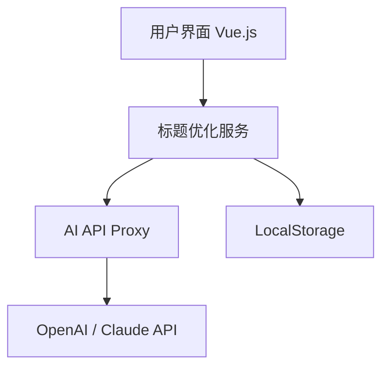

# Shopee Title Optimizer - Technical Design Specification

Feature Name: shopee-title-optimizer
Updated: 2026-04-22

## Description

一个帮助Shopee卖家将商品标题通过AI优化为各地区站点优势标题的Web工具。前端使用Vue.js框架，后端集成第三方AI API（如OpenAI GPT）实现标题优化。

## Architecture



## Tech Stack

- **Frontend**: Vue 3 + Vite
- **Styling**: TailwindCSS
- **HTTP Client**: Axios
- **AI API**: OpenAI GPT-4o / Claude API

## Project Structure

```
shopee-title-optimizer/
├── index.html
├── package.json
├── vite.config.js
├── tailwind.config.js
├── postcss.config.js
├── src/
│   ├── main.js
│   ├── App.vue
│   ├── assets/
│   │   └── main.css
│   ├── components/
│   │   ├── TitleInput.vue        # 标题输入组件
│   │   ├── OptimizeButton.vue     # 优化按钮组件
│   │   ├── SiteCard.vue           # 站点卡片组件
│   │   ├── SiteTabs.vue           # 站点标签组件
│   │   ├── ResultPanel.vue        # 结果展示面板
│   │   ├── SettingsPanel.vue      # 设置面板
│   │   └── LoadingSpinner.vue      # 加载动画
│   ├── services/
│   │   └── aiService.js           # AI API调用服务
│   ├── stores/
│   │   └── appStore.js            # 状态管理
│   └── utils/
│       └── constants.js           # 常量定义（站点信息）
└── .env.example                   # 环境变量示例
```

## Components and Interfaces

### TitleInput.vue

- 输入原始商品标题的文本框
- 显示字符计数
- 实时输入校验

### SiteTabs.vue

- 8个站点标签：TW, MY, SG, PH, TH, VN, ID, ALL
- 点击切换显示对应站点的优化结果
- ALL标签显示所有站点摘要

### SiteCard.vue

Props:
- `site`:站点代码（如 'TW'）
- `siteName`:站点全名（如 '台湾'）
- `flag`:国旗emoji
- `optimizedTitle`:优化后的标题
- `isLoading`:是否加载中
- `isCopied`:是否已复制

Events:
- `@copy`:复制标题事件

### aiService.js

```javascript
// 核心函数
async function optimizeTitle(originalTitle, siteCode, apiKey) {
  // 调用AI API生成优化标题
  // siteCode: TW/MY/SG/PH/TH/VN/ID
  // 返回优化后的标题
}
```

### Prompt Template

```javascript
const PROMPT_TEMPLATE = `You are a Shopee marketplace expert. Optimize the following product title for the {SITE_NAME} ({SITE_CODE}) Shopee marketplace.

Original Title: {ORIGINAL_TITLE}

Requirements:
1. Keep the title within 50-120 characters for Shopee SEO
2. Include popular search keywords for {SITE_NAME} market
3. Use local language style and search habits
4. Highlight key product features
5. Do not include special characters or excessive punctuation

Optimized Title (only output the title, no explanation):`
```

## Site Configuration

```javascript
const SHOPEE_SITES = [
  { code: 'TW', name: '台湾', flag: '🇹🇼', currency: 'TWD', language: 'zh-TW' },
  { code: 'MY', name: '马来西亚', flag: '🇲🇾', currency: 'MYR', language: 'ms-MY' },
  { code: 'SG', name: '新加坡', flag: '🇸🇬', currency: 'SGD', language: 'en-SG' },
  { code: 'PH', name: '菲律宾', flag: '🇵🇭', currency: 'PHP', language: 'en-PH' },
  { code: 'TH', name: '泰国', flag: '🇹🇭', currency: 'THB', language: 'th-TH' },
  { code: 'VN', name: '越南', flag: '🇻🇳', currency: 'VND', language: 'vi-VN' },
  { code: 'ID', name: '印度尼西亚', flag: '🇮🇩', currency: 'IDR', language: 'id-ID' }
]
```

## Data Flow

1. User inputs original title → validates input
2. User clicks "Optimize" → triggers AI optimization
3. For each site → call AI API with site-specific prompt
4. AI returns optimized title → display in corresponding SiteCard
5. User clicks "Copy" → copy to clipboard + show notification

## Error Handling

| Error Type | User Message | Action |
|------------|--------------|--------|
| Empty Input | "请输入商品标题" | Prevent submission |
| API Timeout | "请求超时，请重试" | Show retry button |
| API Quota Exceeded | "API额度已用完，请稍后重试或更换API Key" | Show upgrade suggestion |
| Network Error | "网络连接失败，请检查网络" | Show retry button |
| Invalid API Key | "API Key无效，请检查设置" | Prompt to update key |

## Settings Storage

API Key stored in `localStorage` with key `shopee_optimizer_api_key`

```javascript
// Save API key
localStorage.setItem('shopee_optimizer_api_key', encryptedKey)

// Retrieve API key
const apiKey = localStorage.getItem('shopee_optimizer_api_key')
```

## Vite Configuration

```javascript
// vite.config.js
export default defineConfig({
  server: {
    allowedHosts: ['.monkeycode-ai.online']
  }
})
```

## Responsive Breakpoints

- Mobile: < 640px (single column, stacked cards)
- Tablet: 640px - 1024px (2-column grid)
- Desktop: > 1024px (3-column grid or tab view)

## Testing Strategy

1. **Unit Tests**: Test AI prompt generation, validation logic
2. **Component Tests**: Test individual Vue components
3. **E2E Tests**: Test complete user flow with mocked API
